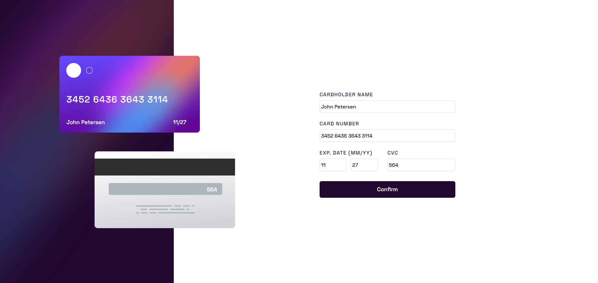
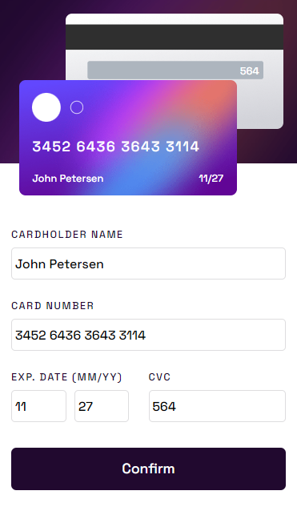
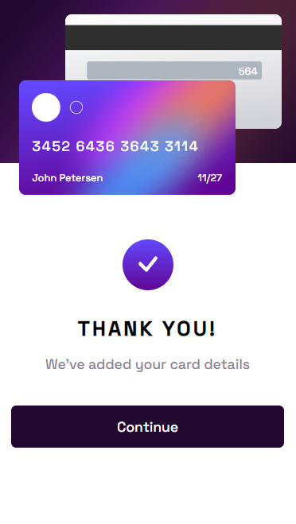

# Frontend Mentor - Interactive card details form

##### Information

**Insta** `npm install`
**run** `npm run`
**E2E tests** `npm run cypress:open`

---

### Links

##### [Link to project Frontend Mentor](https://www.frontendmentor.io/challenges/interactive-card-details-form-XpS8cKZDWw)

<!-- prettier-ignore -->
##### [Link to my solution](https://holmar-card-details.netlify.app/)

---

### Screenshots of my solution

#### Desktop version

 

  

#### Mobiel version

 

 

---

### Screenshots of Frontend mentor's original solution

#### Desktop version

 

  

#### Mobiel version

 

 
